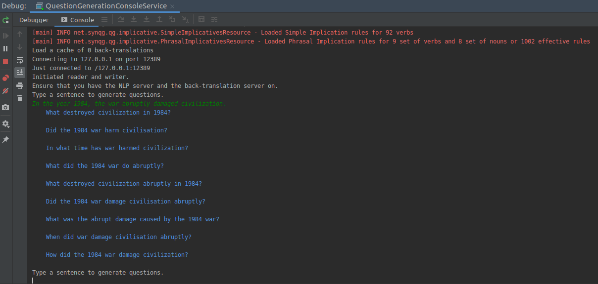
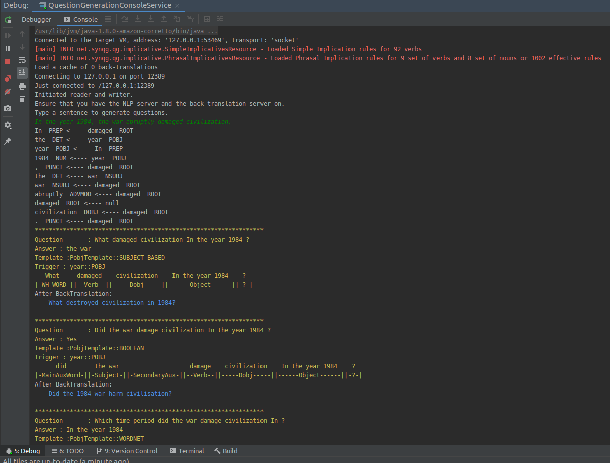

# Syn-QG

[](https://opensource.org/licenses/Apache-2.0) 


Syn-QG is a Java-based question generator which generates questions from multiple sources:
1. Dependency Parsing
2. Semantic Role Labeling
3. NER templates
4. VerbNet Predicates
5. PropBank Roleset Argument Descriptions 
6. Custom Rules 
7. Implication Rules

And then performs back-translation in the end using a en-de and de-en model.

This repo is under construction but can be used to generate good QA pairs.

This repo contains the following code snippets:

1. SRL, Dependency and NER Templates

2. Lauri's Implications (Simple, Phrasal verbs and verb-noun collocations)

3. Java interface for PPDB

4. Java interface for Google N-gram 

5. BackTranslation Services (en-de and de-en)

6. Language Modelling service with AllenNLP backend

7. "Won't" to "Will not" Map

The repo does not include VerbNet and PropBank templates. 

In order to get SynQG up and running, perform the following steps

0. Ensure that you have the Parsing Server installed and running. 
(The Parsing Server is a modified version of the flask server of AllenNLP so it not only contains AllenNLP models 
but other services like wordNet hypernym extraction, verb to noun converter, etc.) 

#### Setting up the Parser Serve

[Conda](https://conda.io/) can be used set up a virtual environment with the
version of Python required for AllenNLP. 

1.  [Download and install Conda](https://conda.io/docs/download.html).

2.  Create a Conda environment with Python 3.6

    ```bash
    conda create -n synqg python=3.6
    ```

3.  Activate the Conda environment. You will need to activate the Conda environment in each terminal in which you want to use AllenNLP.

    ```bash
    conda activate synqg
    ```
    
4. Run pip install . from the root of source folder.

#### Running the module

To run the module, you need to run the following three steps:

1. Start the Parsing server 
    ```bash
    python allennlp/service/server_simple.py
    ```
   
2. Start the Back Translation server
    ```bash
     python backtranslation/back_translation_server.py 
    ```
    
3. To debug how the questions are generated in a console like view, run QuestionGenerationConsoleService.java
   OR 
   Run the below Java snippet:
   
   ```java
   
    import net.synqg.qg.service.GeneratedQuestion;
    import net.synqg.qg.service.SynQGService;
    import java.util.Collections;
    import java.util.List;

    public class SynQgClient {

    public static void main(String[] args) {
        SynQGService synQGService = new SynQGService();
        String input = "John failed to kill Mary.";
        List<GeneratedQuestion> questions = synQGService.generateQuestionAnswers(Collections.singletonList(input));
        for (GeneratedQuestion generatedQuestion : questions) {
            String outline = "";
            outline = outline + generatedQuestion.question() + "\t";
            outline = outline + generatedQuestion.shortAnswer() + "\t";
            outline = outline + generatedQuestion.templateName() + "\t";
            outline = outline + input;
            System.out.println(outline);
        }
       }
    }
    ``` 
    
   With the QuestionGenerationConsoleService, you should be able to check all the generated questions.
   

    If you would like to debug and understand how a question was constructed, which templates/rules were used for construction or what is the corresponding short answer, you can set the the "printLog" variable to true.
    
     ```java
        private static boolean printLogs = true;
   ```
   
   

#### Citations

* [Syn-QG: Syntactic and Shallow Semantic Rules for Question Generation](https://www.aclweb.org/anthology/2020.acl-main.69.pdf)
```bibtext
@inproceedings{dhole-manning-2020-syn,
    title = "Syn-{QG}: Syntactic and Shallow Semantic Rules for Question Generation",
    author = "Dhole, Kaustubh  and
      Manning, Christopher D.",
    booktitle = "Proceedings of the 58th Annual Meeting of the Association for Computational Linguistics",
    month = jul,
    year = "2020",
    address = "Online",
    publisher = "Association for Computational Linguistics",
    url = "https://www.aclweb.org/anthology/2020.acl-main.69",
    pages = "752--765",
}
```